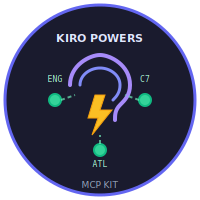

<p align="center">
  
</p>

<h1 align="center">Kiro Powers MCP Kit</h1>

<p align="center">
  Contexto inteligente, memoria persistente, documentacion viva y Jira+Confluence — todo integrado en Kiro.
</p>

<p align="center">
  <a href="https://github.com/andersonlugojacome/kiro-powers-mcp-kit/releases/latest"></a>
  <a href="LICENSE"></a>
  
</p>

## Que es esto

Un **Kiro Power** que transforma tu agente en un companero de equipo contextualizado con:

| MCP Server | Funcion |
|---|---|
| **Engram GO** | Memoria persistente (20 tools, SQLite + FTS5) |
| **Context7** | Documentacion actualizada de cualquier libreria |
| **Atlassian** | Jira + Confluence (read, write, search) — opcional |

Plus: **SDD Workflow** completo (Spec-Driven Development) con 9 fases + 3 skills operativas.

## Instalacion (< 5 minutos)

### 1. Prerequisitos

```bash
# Engram GO (memoria persistente)
brew install gentleman-programming/tap/engram

# Node.js v18+ (Context7 + Atlassian proxy)
node --version  # debe ser >= 18
```

### 2. Instalar el Power en Kiro

1. Abrir Kiro → Panel de Powers → **Add Custom Power**
2. Seleccionar **Import power from GitHub**
3. Ingresar URL: `https://github.com/andersonlugojacome/kiro-powers-mcp-kit`
4. Click **Install**

Kiro registra automaticamente los MCP servers y carga los steering files.

### 3. Configurar Atlassian (opcional)

```bash
cp .env.sample .env
# Editar con tu email y API token de Atlassian
# URL por defecto: https://jirasegurosbolivar.atlassian.net
```

### 4. Verificar

```bash
# macOS/Linux
./scripts/setup.sh

# O en Kiro, escribir: "estatus"
```

## MCP Servers

### Engram GO (memoria persistente)

```json
{ "command": "engram", "args": ["mcp"] }
```

20 MCP tools: `mem_save`, `mem_search`, `mem_get_observation`, `mem_context`, sessions, conflicts, y mas.
Docs: [docs/setup-engram.md](docs/setup-engram.md)

### Context7 (documentacion viva)

```json
{ "command": "npx", "args": ["-y", "@upstash/context7-mcp"] }
```

Sin instalacion adicional. Requiere Node.js 18+.
Docs: [docs/setup-context7.md](docs/setup-context7.md)

### Atlassian (Jira + Confluence) — opcional

```json
{ "url": "https://mcp.atlassian.com/v1/mcp", "headers": { "Authorization": "Basic ${ATLASSIAN_AUTH_TOKEN}" } }
```

Requiere Atlassian Cloud + API token. Setup:
```bash
cp .env.sample .env
# Editar .env con tu email y token
echo -n "tu.email@segurosbolivar.com:tu-api-token" | base64
```
Docs: [docs/setup-atlassian.md](docs/setup-atlassian.md)

## SDD Workflow

```
/sdd-init          — Inicializar proyecto
/sdd-explore       — Explorar un tema
/sdd-new <cambio>  — Explore + Propose
/sdd-ff <cambio>   — Propose > Spec > Design > Tasks
/sdd-apply         — Implementar
/sdd-verify        — Verificar
/sdd-archive       — Archivar
```

## Estructura del repo

```
├── POWER.md                # Metadata + onboarding + docs (Kiro lo lee)
├── mcp.json                # MCP servers (Kiro lo registra)
├── steering/               # Workflows (Kiro los carga on-demand)
│   ├── mcp-workflow.md
│   └── sdd-workflow.md
├── .kiro/
│   ├── skills/             # Skills SDD (referencia para Engram)
│   └── steering/           # Steering detallado
├── docs/                   # Guias por server
├── scripts/                # Verificacion cross-platform
└── .github/workflows/      # CI
```

## Actualizar

En Kiro: Panel de Powers → seleccionar power → **Check for updates** → **Install updates**

O escribir en el chat: **"actualizame"**

## Powers Status

| Power | Estado |
|---|---|
| P1 Contexto inteligente | ✅ |
| P2 Memoria persistente | ✅ |
| P3 Documentacion viva | ✅ |
| P4 Health check | ✅ |
| P5 Actualizacion guiada | ✅ |
| P10 Canales de actualizacion | ✅ |
| P6-P9, P11-P12 Team features | 🔲 Pendiente |

[Roadmap completo](docs/powers-roadmap.md)

## Licencia

MIT
