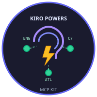

<p align="center">
  
</p>

<h1 align="center">Kiro Powers MCP Kit</h1>

<p align="center">
  <strong>Framework de desarrollo organico (ODD) para Kiro</strong> — routing por complejidad real, memoria persistente y documentacion viva.
</p>

<p align="center">
  <a href="https://github.com/andersonlugojacome/kiro-powers-mcp-kit/releases/latest"></a>
  <a href="LICENSE"></a>
  
  
  
</p>

---

## El problema

Desarrollar con AI agents hoy tiene 3 problemas que nadie resuelve con herramientas sueltas:

1. **Proceso todo-o-nada** — o el agente tira codigo ad-hoc sin pensar, o te obliga a ceremonia pesada (spec/design/tasks) hasta para un typo. Ninguno de los dos escala.
2. **Amnesia entre sesiones** — cada vez que abris una conversacion nueva, perdiste todo el contexto anterior. Decisiones, descubrimientos, patrones: se evaporan.
3. **Documentacion muerta** — se consultan docs desactualizadas y se toman decisiones sobre APIs que ya cambiaron.

Estos no son problemas de *herramientas*. Son problemas de **proceso**.

## Que es esto

Un **framework de desarrollo** que cambia COMO trabajas con Kiro:

> **No es un bundle de herramientas MCP. Es un proceso organico (ODD) que elige la ruta mas liviana que resuelve el problema, con infraestructura de soporte.**

| Capa | Funcion | Como |
|------|---------|------|
| **Proceso (ODD)** | Elige la ruta de implementacion por complejidad real | Direct inline / Delegated direct / Optional SDD |
| **Planificacion (SDD)** | Rama dentro de ODD para cambios con ambiguedad sustancial | explore → propose → spec → design → tasks → apply → verify → archive |
| **Review (RDD)** | Switch independiente, informativo, nunca bloquea delivery | `review assess` con tiers de riesgo (passive/medium/high) |
| **Memoria (Engram GO)** | Persiste decisiones, hallazgos y artefactos entre sesiones | SQLite + FTS5, 20 MCP tools, topic-key upserts |
| **Documentacion (Context7)** | Garantiza que se consulten docs actualizadas | Semantic search sobre librerias, auto-refresh cada 4 queries |
| **Integracion (Jira)** | Conecta el proceso con la gestion del equipo | Read/write/search — opcional |

## ODD — Organic Driven Development (el nucleo)

Cada pedido entra en ODD, en cada runtime, sin que tengas que pedir un workflow. ODD elige **una** de tres rutas de implementacion segun la complejidad real del cambio — nunca por conteo de lineas ni riesgo percibido.

```
                    ┌─ pedido del usuario ─┐
                    │                      │
              ¿autoriza cambio?      (si no: read-only)
                    │
              explorar + clasificar
                    │
      ┌─────────────┼──────────────────────┐
      ▼             ▼                       ▼
 Direct inline  Delegated direct       Optional SDD
 (1-3 archivos, (4+ archivos para      (ambiguedad sustancial;
  mecanico,      entender, 2+ para      SOLO por pedido explicito
  sin diseno)    escribir, research)    o propuesta aceptada)
```

| Ruta | Cuando aplica | Que hace |
|------|---------------|----------|
| **Direct inline** | 1–3 archivos, cambio mecanico ya entendido, sin ambiguedad de diseno | Edita directamente, sin artefactos SDD |
| **Delegated direct** | 4+ archivos para entender, 2+ archivos no-triviales para escribir, research amplio | Delega a un worker acotado, sin artefactos SDD |
| **Optional SDD** | Ambiguedad de diseno, multiples decisiones, scope complejo | Propone SDD; ejecuta SOLO tras aceptacion del usuario |

**Regla de oro**: el numero de archivos, las lineas cambiadas o el riesgo percibido NUNCA fuerzan SDD por si solos. SDD se selecciona SOLO por solicitud explicita del usuario o propuesta aceptada.

### Mandatory Delegation Triggers

ODD delega automaticamente para mantener el hilo principal liviano:

| Trigger | Se dispara cuando | Accion |
|---|---|---|
| **Mapping** | Entender requiere 4+ archivos | Delegar una exploracion acotada antes de decidir |
| **Writer** | Implementacion toca 2+ archivos no-triviales | Delegar un writer acotado en vez de editar inline |
| **Preparation** | Lectura que prepara un write, o research amplio | Delegar junto con o antes del write |
| **Long-session backstop** | ~20 tool calls / 5 lecturas / 2 edits sin delegar | Pausar y delegar la siguiente unidad |

### Tracking automatico (solo para trabajo sustancial)

Cuando el trabajo es sustancial (2+ pasos de implementacion o progreso que vale recuperar tras una interrupcion), ODD crea automaticamente antes del primer write:

- `odd/tasks/<feature-name>.md` — documento vivo con objetivo, scope, checklist, criterios y evidencia
- Espejo en Engram bajo el topic `odd/<feature-name>/tasks` — recuperable en cualquier sesion futura

El trabajo pequeño y entendido NO crea artefactos: se resuelve inline sin ceremonia.

## SDD Workflow — La rama de planificacion

SDD es una **rama dentro de ODD**, no el default. Se usa cuando el cambio tiene ambiguedad sustancial que proposal/spec/design reducen materialmente.

```
  explore ─→ propose ─→ spec ──→ tasks ─→ apply ─→ verify ─→ archive
                          ↑                  │
                       design ───────────────┘
```

### Fases

| Fase | Que produce | Comando |
|------|-------------|---------|
| **Init** | Contexto del proyecto (stack, convenciones, testing) | `/sdd-init` |
| **Explore** | Investigacion de alternativas y riesgos | `/sdd-explore <tema>` |
| **Propose** | Propuesta formal con intent, scope y approach | `/sdd-new <cambio>` |
| **Spec** | Requisitos verificables y escenarios | (automatico en pipeline) |
| **Design** | Decisiones de arquitectura y approach tecnico | (automatico en pipeline) |
| **Tasks** | Descomposicion en tareas concretas por lotes | (automatico en pipeline) |
| **Apply** | Implementacion por lotes secuenciales | `/sdd-apply` |
| **Verify** | Validacion contra specs (CRITICAL / WARNING / SUGGESTION) | `/sdd-verify` |
| **Archive** | Cierre y persistencia del cambio completado | `/sdd-archive` |

### Fast-forward

Para cambios donde ya tenes claridad y elegiste SDD:

```
/sdd-ff <nombre-del-cambio>
```

Ejecuta: propose → spec → design → tasks en secuencia sin pausas intermedias.

> 📖 **Nuevo en el framework?** Lee la [Guía de Inicio paso a paso](docs/sdd-getting-started.md) — ODD por defecto, SDD cuando aplica.

### Ventajas concretas

- **Routing organico** — la ruta mas liviana que resuelve el problema; sin ceremonia innecesaria
- **Delivery por work units** — commits como unidades revisables; si el forecast supera ~400 lineas, propone chained PRs
- **Strict TDD Mode** — detecta test runner y fuerza ciclos test-first cuando esta habilitado
- **Cross-session continuity** — el documento de feature y su espejo Engram se recuperan en cualquier sesion futura
- **Dependency gating (en SDD)** — no se hace apply sin tasks, ni tasks sin spec+design
- **Delivery strategy** — soporta `ask-on-risk`, `auto-chain`, `single-pr`, `exception-ok`
- **Execution Loop Controller** — gobierna el ciclo apply⇄verify con control determinista (ver abajo)

### Execution Loop Controller (ELC)

El ELC transforma el ciclo implicito `apply → falla → re-apply` en un proceso programatico y determinista:

```
  apply(task) ─→ verify(task) ─→ loop_feedback
                                      │
                         ┌────────────┴────────────┐
                         │                         │
                      [PASS]                    [FAIL]
                         │                         │
                    next task              iteration < max?
                                               │
                                    ┌──────────┴──────────┐
                                    │                     │
                                   SI                    NO
                                    │                     │
                          rollback/patch +         escalar al humano
                          accumulate constraint    con contexto
                                    │
                               re-apply(task)
```

| Capacidad | Que hace |
|-----------|----------|
| **Criterio de parada** | Max 3 iteraciones por tarea (configurable hasta 5). Sin loops infinitos. |
| **Rollback granular** | `PATCH_FORWARD` (fix encima del progreso) vs `ROLLBACK_AND_RETRY` (git checkout y approach diferente) |
| **Constraint accumulation** | Cada fallo se comprime a 200 chars y se inyecta como restriccion obligatoria al re-apply |
| **Context7 conditional** | Si el error indica API deprecada/firma incorrecta, refresca docs automaticamente antes del re-apply |
| **Post-mortem inteligente** | Lecciones arquitectonicas se persisten en Engram (no typos ni errores mecanicos) |
| **Aislamiento por tarea** | El fallo de Task 1.1 no afecta ni bloquea Task 1.2 |

## RDD — Receipt-Driven Development (switch independiente)

Desde gentle-ai v3.0.0, **RDD salio del lifecycle de SDD** y es un sistema de review independiente, opt-in y **off por defecto**. El usuario lo controla con un switch:

```bash
gentle-ai review mode enable    # activar
gentle-ai review mode disable   # desactivar (kill switch)
gentle-ai review mode status    # solo lectura, no cambia nada
```

### Principio fundamental

> **Review es informativo — NUNCA bloquea delivery. Approval es evidencia, no autoridad. Delivery es del humano bajo la politica normal del repo.**

### Seleccion por tier de riesgo (`review assess`)

Con RDD habilitado, cada candidato (un work-unit commit o una PR slice) se evalua con `gentle-ai review assess` y cae en un tier:

| Tier | Comportamiento | Consentimiento |
|---|---|---|
| **Passive / Low** | Checks estructurales silenciosos; la frontera avanza | No |
| **Medium** | Se difiere; el candidato es la PR slice acumulada (~400 lineas) | Si |
| **High** | Review completo (auth, payments, >400 lineas) | Si + forecast |

Nunca se infiere "low" de un assessment fallido. Sin `gentle-ai` CLI, las 4R lens funcionan como checklists de calidad standalone durante la implementacion.

### 4R Lens System

| Lens | ID | Foco |
|---|---|---|
| Risk | R1 | Seguridad, boundaries de privilegio, exposicion de datos |
| Readability | R2 | Naming, complejidad, intencion, mantenibilidad |
| Reliability | R3 | Tests, edge cases, determinismo, contratos |
| Resilience | R4 | Fallbacks, retry, degradacion, observabilidad |

## Infraestructura MCP (lo que soporta el framework)

### Engram GO — Memoria persistente

```json
{ "command": "engram", "args": ["mcp"] }
```

20 MCP tools. Persiste artefactos SDD/ODD, decisiones, hallazgos, y progreso entre sesiones.
Docs: [docs/setup-engram.md](docs/setup-engram.md)

### Context7 — Documentacion viva

```json
{ "command": "npx", "args": ["-y", "@upstash/context7-mcp"] }
```

Auto-refresh cada 4 queries. Sin instalacion adicional. Node.js 18+.
Docs: [docs/setup-context7.md](docs/setup-context7.md)

### Jira — Integracion con gestion (opcional)

```json
{ "command": "npx", "args": ["-y", "@aashari/mcp-server-atlassian-jira"] }
```

Read/write/search sobre Jira Cloud. Requiere API token.
Docs: [docs/setup-atlassian.md](docs/setup-atlassian.md)

## Instalacion (< 5 minutos)

### 1. Prerequisitos

```bash
# Engram GO (memoria persistente)
brew install gentleman-programming/tap/engram

# Node.js v18+ (Context7 + Jira)
node --version  # debe ser >= 18
```

### 2. Instalar el Power en Kiro

1. Abrir Kiro → Panel de Powers → **Add Custom Power**
2. Seleccionar **Import power from GitHub**
3. Ingresar URL: `https://github.com/andersonlugojacome/kiro-powers-mcp-kit`
4. Click **Install**

Kiro registra automaticamente los MCP servers y carga los steering files.

### 3. Configurar Jira (opcional)

```bash
cp .env.sample .env
# Editar con tu email y API token de Atlassian
```

### 4. Verificar

```bash
# macOS/Linux
./scripts/setup.sh

# O en Kiro, escribir: "estatus"
```

## Skills incluidas

| Skill | Funcion |
|---|---|
| `sdd-init` | Inicializa contexto SDD del proyecto |
| `sdd-explore` | Explora ideas y alternativas |
| `sdd-propose` | Crea propuesta de cambio |
| `sdd-spec` | Escribe especificaciones verificables |
| `sdd-design` | Define diseno y arquitectura |
| `sdd-tasks` | Descompone en tareas por lotes |
| `sdd-apply` | Implementa siguiendo specs |
| `sdd-verify` | Verifica contra specs y tasks |
| `sdd-archive` | Archiva cambio completado |
| `review-risk` / `review-readability` / `review-reliability` / `review-resilience` | 4R lens de review (standalone o via RDD) |
| `skill-creator` | Crea nuevas skills |
| `mcp-status-assistant` | Muestra estado MCP |
| `kiro-update-assistant` | Guia actualizaciones |

## Estructura del repo

```
├── POWER.md                # Metadata + onboarding (Kiro lo lee)
├── mcp.json                # MCP servers (Kiro los registra)
├── steering/               # Workflows del framework
│   ├── mcp-workflow.md     # Politica de orquestacion MCP
│   └── sdd-workflow.md     # Reglas de proceso ODD + SDD
├── .kiro/
│   ├── skills/             # Skills SDD + review (4R) + operativas
│   └── steering/           # Steering detallado (ODD runtime)
├── docs/                   # Guias de setup por server
├── scripts/                # Verificacion cross-platform
└── .github/workflows/      # CI
```

## Actualizar

En Kiro: Panel de Powers → seleccionar power → **Check for updates** → **Install updates**

O escribir en el chat: **"actualizame"**

## Roadmap

| Power | Estado |
|---|---|
| P1 Contexto inteligente | ✅ |
| P2 Memoria persistente | ✅ |
| P3 Documentacion viva | ✅ |
| P4 Health check | ✅ |
| P5 Actualizacion guiada | ✅ |
| P10 Canales de actualizacion | ✅ |
| P6-P9, P11-P12 Team features | 🔲 Pendiente |

[Roadmap completo](docs/powers-roadmap.md)

## Licencia

MIT
